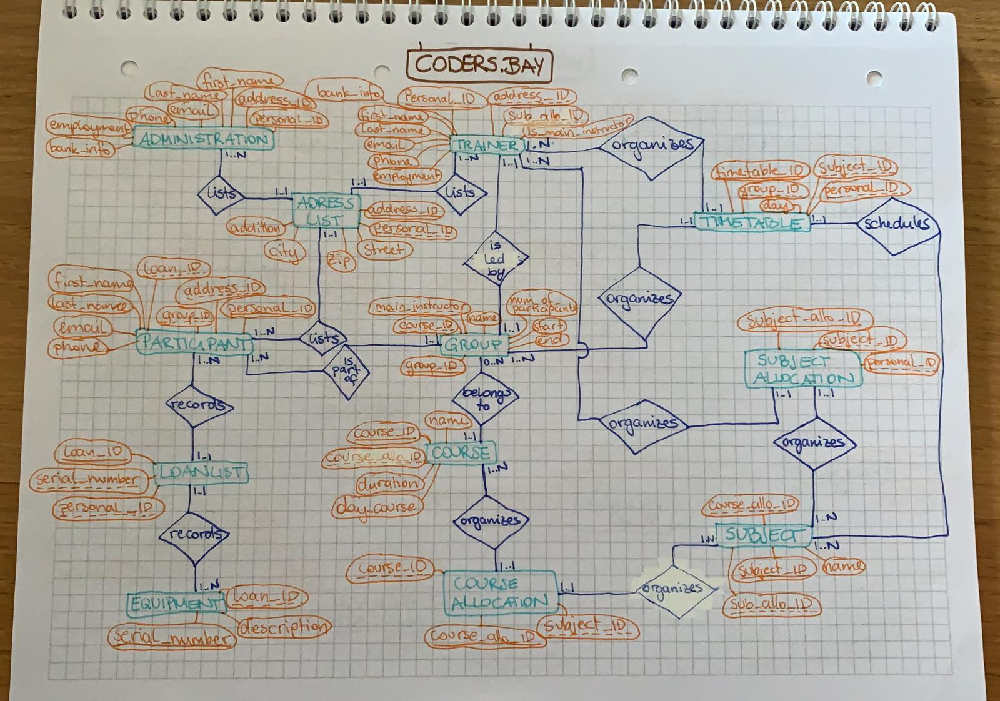

coders-bay-erm-captainlisa

# ERM

# relational model

* Trainer (**personal_ID:int**, *address_ID:int*, *timetable_ID:int*, *sub_allo_ID:int*, is_main_instructor:boolean, first_name:varchar(20), last_name:varchar(20), email:varchar(32), phone:varchar(25), employment:varchar(32), bank_information:varchar(32))
* Administration (**personal_ID:int**, *address_ID:int*, first_name:varchar(20), last_name:varchar(20), email:varchar(32), phone:varchar(25), employment:varchar(32), bank_information:varchar(32))
* Addresslist (**address_ID:int**, personal_ID:int, street:varchar(32), zip:varchar(5), city:varchar(20), addition:varchar(20))
* Participant (**personal_ID:int**, *address_ID:int*, *group_ID:int*, *loan_ID:int*, first_name:varchar(20), last_name:varchar(20), email:varchar(32), phone:varchar(25))
* Course Group (**group_ID:int**, *course_ID:int*, *main_instructor:int*, group_name:varchar(32), num_of_participants:int, course_start:date, course_end:date)
* Course (**course_ID:int**, *course_allo_ID:int*, designation:varchar(32), duration:timestamp, day_course:boolean)
* Equipment (**serial_number:varchar(32)**, *loan_ID:int*, description:varchar(50))
* Loan List (**loan_ID:int**, serial_number:varchar(32), personal_ID:int)
* Subject (**subject_ID:int**, *sub_allo_ID:int*, *course_allo_ID:int*, *timetable_ID:int*, designation:varchar(10))
* Subject Allocation (**sub_allo_ID:int**, subject_ID:int, personal_ID:int)
* Course Allocation (**course_allo_ID:int**, course_ID:int, subject_ID:int)
* Timetable (**timetable_ID:int**, group_ID:int, subject_ID:int, personal_ID:int, week_day:varchar(32))
